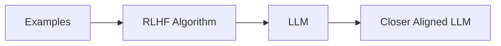
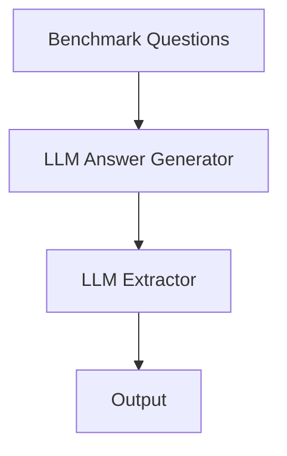

Overview
===
This presentation would cover as follows:
<!-- incremental_lists: true -->
<!-- list_item_newlines: 2 -->
1. **Motivation & Rationale**
2. **Introduction**
3. **Background**
4. **Thesis Statement**
5. **Methodology**
6. **Next Steps**
<!-- pause -->
All the slides content are taken from the thesis.
<!-- incremental_lists: false -->
<!-- end_slide -->

Motivation & Rationale - Passion & DeepSeek
===
Even before creating the proposal:
<!-- incremental_lists: true -->
<!-- list_item_newlines: 2 --> 
- I've been passionate:
  - When **ChatGPT** and **GPT-3.5** come out, I was there testing it.
  - I saw the writing on the wall, when testing those models.
  - LLMs are the **future**.
  - It could greatly simplify tasks that would take hours to do. 
- Testing models was not the end.
- I've created AI side projects.

Knowing all that I decided:
- Focus on something LLM related.
- Knew that LLM research was difficult.
- But...
  - I was aware of DeepSeek.
  - Some aspects of research were not explained.
  - Multiple research questions were created.
- I ended up with:
  - **Comparative Analysis of Chain-of-Thought Prompting Versus Reasoning Large Language Models.**
  - The thesis attempts to fill in holes left by rapid expansion of the field.
<!-- end_slide -->

Introduction
===
<!-- incremental_lists: true -->
<!-- list_item_newlines: 2 -->
<!-- alignment: left -->
The thesis does not focus on the architecture of LLMs but instead focuses on:
  - Reasoning.
  - Training:
    - The fine-tuning phase.
      - Reinforcement Learning with Human Feedback (RLHF).
      - Distillation.
  - Prompting:
    - Chain of Thought (CoT) Prompting.

<!-- end_slide -->

Introduction - Reasoning
===
<!-- incremental_lists: true -->
<!-- list_item_newlines: 2 --> 
What are reasoning models?
- A new type of LLM that rose to prominence this year.
- Two main ways that will be covered:
  - Chain-of-thought prompting:
    - Increases inference time.
    - Inference time is used to decompose the problem into small parts.
    - The model is given more time to second guess itself.
  - Fine-tuning techniques:
    - RLHF with CoT.
      - Uses CoT Prompting.
      - Automatic version of CoT Prompting.
    - Distillation
      - Takes teacher output tokens.
      - Trains on them.
      - Effectively learns reasoning through the teacher model.
<!-- end_slide -->

Background - CoT Prompting
===
<!-- incremental_lists: true -->
<!-- list_item_newlines: 2 --> 
- Two types of CoT:
  - Multi-Shot CoT or just CoT
    - Does use examples within the prompt.
<!-- pause -->
```markdown
Q: Roger has 5 tennis balls. He buys 2 more cans of tennis
balls. Each can has 3 tennis balls. How many tennis balls does
he have now?
A: The answer is 11

Q: ...
A: ...
```
<!-- alignment: center -->
Figure 1: Example of CoT as per [3]

<!-- alignment: left -->
  - Zero-Shot CoT
    - Does not use examples within the prompt.
<!-- pause -->
```markdown
Q: On average Joe throws 25
punches per minute. A fight
lasts 5 rounds of 3 minutes. How
many punches did he throw?

A: Let’s think step by step.
```
<!-- alignment: center -->
Figure 2: Example of CoT as per [1]


<!-- alignment: left -->
- Many Activation phrases were tested:
  - "Let's think step by step"
    - The highest increase of accuracy
- How does CoT prompting compare to baseline? 
<!-- pause -->
```latex +render
\begin{table}[h]
    \par
    \bigskip
    \centering
    \begin{tabular}{  m{8cm}  m{2cm}  m{2cm} } 
        \hline
         & \centerline{MultiArith} & \centerline{GSM8K} \\ 
        \hline
        text-davinci-002: Zero-Shot & \centerline{17.7} & \centerline{10.4} \\ 
        \textbf{text-davinci-002: Zero-Shot-CoT} & \centerline{\textbf{78.7}} & \centerline{\textbf{40.7}} \\ 
        \hline
        PaLM 540B: Zero-Shot & \centerline{25.5} & \centerline{12.5} \\ 
        \textbf{PaLM 540B: Zero-Shot-CoT} & \centerline{\textbf{66.1}} & \centerline{\textbf{43.0}} \\ 
        \hline
    \end{tabular}
\end{table}
```
<!-- alignment: center -->
Figure 3: Results of CoT Prompting as per [1]

<!-- end_slide -->
Background - RLHF
===
<!-- incremental_lists: true -->
<!-- list_item_newlines: 2 --> 
What is Reinforcement Learning with Human Feedback in the context of LLMs?
- Used in the alignment step (Fine-Tuning).
- Uses human-provided responses to questions.
- In context of reasoning models:
  - Uses CoT Prompting examples (Or any other reasoning prompting method).
  - Makes models closer aligned to what was given in the examples.
<!-- pause -->

<!-- alignment: center -->
Figure 4: Example of a RLHF pipeline as per [4]
<!-- alignment: left -->

- How does RLHF-CoT compare to baseline? 
<!-- pause -->
```latex +render
\begin{table}[h]
    \par
    \bigskip
    \centering
    \begin{tabular}{  m{5cm}  m{2.5cm}  m{2.5cm} } 
        \hline
        Benchmark & \centerline{DeepSeek-V3} & \centerline{\textbf{DeepSeek-R1}} \\ 
        \hline
        SWE Verified & \centerline{42.0} & \centerline{\textbf{49.2}} \\ 
        LiveCodeBench & \centerline{36.2} & \centerline{\textbf{65.9}} \\
        Aider-Polyglot & \centerline{49.6} & \centerline{\textbf{53.3}} \\
        \hline
        AIME 2024 & \centerline{39.2} & \centerline{\textbf{79.8}} \\ 
        MATH-500 & \centerline{90.2} & \centerline{\textbf{97.3}} \\ 
        CNMO 2024 & \centerline{43.2} & \centerline{\textbf{78.8}} \\ 
        \hline
    \end{tabular}
\end{table}
```
<!-- alignment: center -->
Figure 5: Results of RLHF-CoT as per [2]

<!-- end_slide -->
Thesis Statement
===
Taken directly from the Thesis:
<!-- pause -->
```markdown
This paper examines the differences between Zero-Shot-Chain-of-Thought Prompting
and Reinforcement Learning with Human Feedback in both performance and time
taken to answer a correct question.
```
<!-- alignment: center -->
Figure 6: Excerpt from the Thesis

<!-- alignment: left -->
What does this mean?
<!-- incremental_lists: true -->
<!-- list_item_newlines: 2 --> 
- Find where ZS-CoT lies compared to RLHF Reasoning models
- Use accuracy and efficiency as a point of comparison.
  - **Accuracy**: How well does the model do in benchmarks?
  - **Efficiency**: How fast it does it. 
- Math and Coding benchmarks are great choices for evaluating reasoning models.
- Use pre-existing benchmarks such as SWE-Bench and AIME 2025.
- We must ensure each test model family has:
  - Has a reasoning model.
  - Has an original model before reasoning techniques.
  - Under those standards the DeepSeek-R1 family passes.
<!-- end_slide -->

Methodology
===
<!-- incremental_lists: true -->
<!-- list_item_newlines: 2 --> 
The process of benchmarking would be as follows (AIME 2025):
1. Pull Benchmark from Hugging Face.
2. Download model to the LLM pipeline (Ollama).
3. Run model on the pipeline.
4. Create an LLM script to input every question into the model.
5. For every response use another LLM to extract the answer from the initial response.
6. We then structure a json file, where every line of json is a question object.
7. We do this for every question and then compare with the original.
<!-- new_lines: 4 -->
<!-- alignment: center -->
<!-- pause -->
```markdown
{"question_num": 0, "model_name": "DeepSeek-R1-Distill-Llama-8B", "answer": "70", "time": 24.789}
```
Figure 7: Example of jsonl

<!-- end_slide -->


Methodology - Basic Pipeline
===
What does this pipeline look like?
<!-- pause -->

<!-- column_layout: [1, 1] -->
<!-- column: 0 -->

**DeepSeek-R1:8b**
<!-- pause -->
```python {1|2|3|5-14|12|16|1-16} +line_numbers +exec
/// from ollama import Client
/// import polars as pl
client = Client(host='http://ollama:11434', headers={'x-some-header': 'some-value'})
GEN_MODEL = 'hf.co/unsloth/DeepSeek-R1-Distill-Llama-8B-GGUF:Q8_0'
BASE_SYSTEM = "Give me one a single answer in numeric form do not add comments."

def chat_once(prompt_text: str):
    messages = [{'role': 'system', 'content': BASE_SYSTEM}] if BASE_SYSTEM else []
    messages.append({'role': 'user', 'content': prompt_text})
    return client.chat(
        model=GEN_MODEL,
        messages=messages,
        stream=True,
        options={'num_ctx': 8000, 'temperature': 0.6, 'top_p': 0.95},
        keep_alive=-1
    )

prompt = "What is 1 + 1" # Proxy for benchmark
/// stream = chat_once(prompt)
/// for chunk in stream:
///    msg = chunk.get('message', {})
///    if 'content' in msg:
///        token = msg['content']
///        print(token, end='', flush=True)   
```
<!-- column: 1 -->
<!-- pause -->

**Llama3.1:8b**
<!-- pause -->
```python {2|1-16} +line_numbers +exec
/// from ollama import Client
/// import polars as pl
client = Client(host='http://ollama:11434', headers={'x-some-header': 'some-value'})
GEN_MODEL = 'llama3.1:8b-instruct-q8_0'
BASE_SYSTEM = "Give me one single answer in numeric form, do not add comments."

def chat_once(prompt_text: str):
    messages = [{'role': 'system', 'content': BASE_SYSTEM}] if BASE_SYSTEM else []
    messages.append({'role': 'user', 'content': prompt_text})
    return client.chat(
        model=GEN_MODEL,
        messages=messages,
        stream=True,
        options={'num_ctx': 8000, 'temperature': 0.6, 'top_p': 0.95},
        keep_alive=-1
    )

prompt = "What is 1 + 1" # Proxy for benchmark
/// stream = chat_once(prompt)
/// for chunk in stream:
///    msg = chunk.get('message', {})
///    if 'content' in msg:
///        token = msg['content']
///        print(token, end='', flush=True)   
```

<!-- end_slide -->

Methodology - Revised Pipeline
===
<!-- column_layout: [1, 1] -->
<!-- column: 0 -->
<!-- pause -->


<!-- column: 1 -->
<!-- pause -->
**DeepSeek-R1:8b** with **Llama3.1:8b**


<!-- pause -->
```python {1-24|18|20|22|1-24} +line_numbers +exec
/// from ollama import Client
/// import polars as pl
/// import json, re, time
/// client = Client(host='http://ollama:11434', headers={'x-some-header': 'some-value'})
GEN_MODEL = 'hf.co/unsloth/DeepSeek-R1-Distill-Llama-8B-GGUF:Q8_0'
EXTRACT_MODEL = 'llama3.1:8b-instruct-q8_0'
BASE_SYSTEM = "Give me one a single answer in numeric form do not add comments."


def chat_once(prompt_text: str):
    messages = [{'role': 'system', 'content': BASE_SYSTEM}] if BASE_SYSTEM else []
    messages.append({'role': 'user', 'content': prompt_text})
    return client.chat(
        model=GEN_MODEL,
        messages=messages,
        stream=True,
        options={'num_ctx': 8000, 'temperature': 0.6, 'top_p': 0.95},
        keep_alive=-1
    )

/// THINK_RE = re.compile(r'(?is)<think>\s*.*?\s*</think>')
    
def strip_think(s: str) -> str:
///    return THINK_RE.sub('', s).strip()
/// BOXED_RE = re.compile(r'\\boxed\s*\{\s*([\-+]?\d+)\s*\}')
/// INLINE_DOLLAR_INT_RE = re.compile(r'\$?\s*([\-+]?\d+)\s*\$?')
/// INT_RE = re.compile(r'([\-+]?\d+)')

def extract_answer(model_output: str) -> str: # Secondary Model Extractor
///    cleaned = strip_think(model_output)
///    candidate = cleaned
///    if candidate and candidate.lstrip('+-').isdigit():
///        return candidate.strip()
///    system = (
///        "Extract ONLY the final numeric answer from the text. "
///        "Return just the number (no words, no punctuation, no units)."
///    )
///    messages = [{'role': 'system', 'content': system},
///                {'role': 'user', 'content': cleaned}]
///    stream = client.chat(
///        model=EXTRACT_MODEL, messages=messages, stream=True,
///        options={'num_ctx': 8000, 'temperature': 0.6, 'top_p': 0.95}, keep_alive=-1
///    )
///    reply = []
///    for chunk in stream:
///        msg = chunk.get('message', {})
///        if 'content' in msg:
///            reply.append(msg['content'])
///    out = ''.join(reply).strip()
///    return out.strip()
    
prompt = "What is 1 + 1"

/// stream = chat_once(prompt)
/// full_reply_parts = []
/// for chunk in stream:
///    msg = chunk.get('message', {})
///    if 'content' in msg:
///       token = msg['content']
///       full_reply_parts.append(token)
/// full_reply = ''.join(full_reply_parts)
answer = extract_answer(full_reply)
/// print(answer)
```
<!-- end_slide -->

Preliminary Findings - Accuaracy
===
<!-- alignment: center -->
Results of AIME 2025: DeepSeek-R1:8B vs Llama3.1:8b 
<!-- pause -->
```latex +render
\begin{table}[h]
    \par
    \bigskip
    \centering
    \begin{tabular}{  m{6.5cm}  m{2cm}  } 
        \hline
        Model & \centerline{AIME 2025} \\ 
        \hline
        Llama3.1:8B-CoT & \centerline{0} \\ 
        \textbf{DeepSeek-R1:8B} & \centerline{\textbf{33.3}} \\  
        \hline
    \end{tabular}
\end{table}
```
<!-- alignment: center -->
Figure 8: Results of AIME 2025 (Accuracy)

<!-- incremental_lists: true -->
<!-- list_item_newlines: 2 -->
<!-- alignment: left -->
What are the reasons why CoT Prompting does so poorly? (speculation)
- Well..
  - The paper actually supports this:

<!-- pause -->
.png)
<!-- alignment: center -->
Figure 9: Results of ZS and ZS-CoT as per [1]
<!-- alignment: left -->

- The benchmark is too hard for the models.
- Model options were not optimal.
- Lower parameter models do not adhere to CoT Prompting.
<!-- end_slide -->

Preliminary Findings - Efficiency 
===
<!-- pause -->

<!-- alignment: center -->
Figure 8: Results of AIME 2025 (Efficiency)
<!-- alignment: left -->
<!-- incremental_lists: true -->
<!-- list_item_newlines: 2 -->
What is going on here? (speculation)
- In this graph we can see that DeepSeek-R1:8B takes significantly more time.
- Perhaps if we increase the number of models tested we see a correlation between thinking time and model performance.

<!-- end_slide -->
Next Steps
===
<!-- incremental_lists: true -->
<!-- list_item_newlines: 2 --> 
The immediate next steps are:
- Expand as much as possible:
  - Benchmark more models.
  - Test different model sizes across viable model families.
  - Add more benchmarks in the test suite.
<!-- end_slide -->

References
===
<!-- incremental_lists: false -->
[1] Takeshi Kojima, Shixiang Shane Gu, Machel Reid, Yutaka Matsuo, and Yusuke
Iwasawa. Large language models are zero-shot reasoners, 2023.
<!-- new_line -->

[2] DeepSeek-AI, Daya Guo, Dejian Yang, Haowei Zhang, Junxiao Song, Ruoyu
Zhang, Runxin Xu, Qihao Zhu, Shirong Ma, Peiyi Wang, Xiao Bi, Xiaokang
Zhang, Xingkai Yu, Yu Wu, et al. Deepseek-r1: Incentivizing reasoning capability
in llms via reinforcement learning, 2025.
<!-- new_line -->

[3] Jason Wei, Xuezhi Wang, Dale Schuurmans, Maarten Bosma, Brian Ichter, Fei
Xia, Ed Chi, Quoc Le, and Denny Zhou. Chain-of-thought prompting elicits
reasoning in large language models, 2023.

